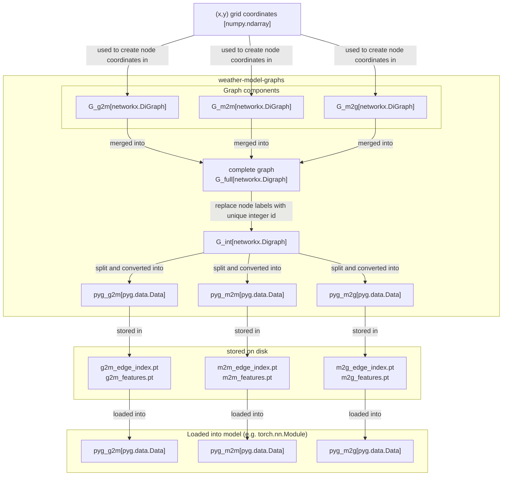

# weather-model-graphs

`weather-model-graphs` is a package for creating, visualising and storing message-passing graphs for data-driven weather models.

The package is designed to use `networkx.DiGraph` objects as the primary data structure for the graph representation right until the graph is to be stored on disk into a specific format.
This makes the graph generation process modular (every step outputs a `networkx.Digraph`), easy to debug (visualise the graph at any step) and allows output to different file-formats and file-structures to be easily implemented. More details are given in the [background and design](#background-and-design) section below.


## Installation

```
pdm install
```

### pytorch support

cpu only:

```bash
PIP_INDEX_URL=https://download.pytorch.org/whl/cpu pdm install --group pytorch
```

gpu support (see https://pytorch.org/get-started/locally/#linux-pip for older versions of CUDA):


```bash
pdm install --group pytorch
```

# Usage

The best way to understand how to use `weather-model-graphs` is to look at the [notebooks/constructing_the_graph.ipynb](notebooks/constructing_the_graph.ipynb) notebook, to have look at the tests in [tests/](tests/) or simply to read through the source code. 
In addition you can read the [background and design](#background-and-design) section below to understand the design principles of `weather-model-graphs`.

## Example, Keisler 2021 flat graph architecture

```python
import numpy as np
import weather_model_graphs as wmg

# define your (x,y) grid coodinates
xy_grid = np.meshgrid(np.linspace(0, 1, 32), np.linspace(0, 1, 32), indexing='ij')

# create the full graph
graph = wmg.create.archetypes.create_keissler_graph(xy=xy_grid)

# split the graph by component
graph_components = wmg.split_graph_by_edge_attribute(graph=graph, attribute='component')

# save the graph components to disk in pytorch-geometric format
for component, graph in graph_components.items():
    wmg.save.to_pyg(graph=graph, name=component)
```

# Background and design

The only input the graph generation in `weather-model-graphs` requires is the static `(x,y)` *grid* coordinates of the atmospheric state as the state changes over time. These coordinates are used to create the **grid nodes** nodes of the graph, with a node for each `(x,y)` coordinate.
In addition to grid nodes the graph also contains **mesh nodes** that represent the latent space of the model at a set of `(x,y)` coordinates (this are in general a different set of coordinates to the **grid nodes** coordinates).

In summary, there are two sets of nodes in the graph:

- **grid nodes**: representing the physical variables of the atmospheric state at a specific `(x,y)` coordinate

- **mesh nodes**: representing the latent space of the model at specific `(x,y)` coordinate

With these two sets of nodes, the graph is constructed by connecting the **grid nodes** to the **mesh nodes** and the **mesh nodes** to each other.
The edges between the **grid nodes** and the **mesh nodes** represent the encoding of the physical variables into the latent space of the model, while the edges between the **mesh nodes** represent the processing of the latent space through the time evolution of the atmospheric state.

In summary, the complete message-passing graph consists of three components:

- **grid-to-mesh** (`g2m`): the encoding compenent, where edges represent the encoding of physical variables into the latent space of the model

- **mesh-to-mesh** (`m2m`): the processing component, where edges represent information flow between nodes updating the latent presentation at mesh nodes through the time evolution of the atmospheric state

- **mesh-to-grid** (`m2g`): the decoding component, where edges represent the decoding of the latent space back into physical variables


## Design principles

The key design principle of `weather-model-graphs` is to work with `networkx.DiGraph` objects as the primary data structure for the graph representation right until the graph is to be stored on disk into a specific format.
Using only `networkx.DiGraph` objects as the intermediate representations makes it possible to

1) easily modularise the whole generation process, with every step outputting a `networkx.DiGraph` object,
2) easily visualise the graph resulting from any step and
3) easily connect graph nodes across graph components, combine graphs and split graphs based on node and edge attributes.

The graph generation in `weather-model-graphs` is split into to the following steps:

1. Create the three graph components of the message-passing graph that constitute the auto-regressive atmospheric flow model, all represented by `networkx.DiGraph` objects:

    - **grid-to-mesh** (`g2m`): the encoding compenent, where edges represent the encoding of physical variables into the latent space of the model

    - **mesh-to-mesh** (`m2m`): the processing component, where edges represent information flow between nodes through the time evolution of the atmospheric state

    - **mesh-to-grid** (`m2g`): the decoding component, where edges represent the decoding of the latent space back into physical variables

2. Combine all three graph components into a single `networkx.DiGraph` object and create a unique node identifier for each node in the combined graph.
3. Split the combined graph into the three *output* graph components again (or more if the specific graph architecture requires it).
4. Store each of the *output* graph components in the desired format, for example:

    - **networkx** `.pickle` file: save `networkx.DiGraph` objects using `pickle` to disk (`weather_model_graphs.save.to_pickle(...)`)

    - [pytorch-geometric](https://github.com/pyg-team/pytorch_geometric) for [neural-lam](https://github.com/mllam/neural-lam): edges indexes and features are stored in separate `torch.Tensor` objects serialised to disk that can then be loaded into `torch_geometric.data.Data` objects (`weather_model_graphs.save.to_pyg(...)`
    
### Diagram of the graph generation process:
    
Below visualises the graph generation process in `weather-model-graphs` for the example given above:



### Node and edge attributes

There are a number of node and edge attributes with special meanings in `weather-model-graphs` which enable the splitting and visualisation of the graph components.

#### Node attributes

- `pos`: the `(x,y)` coordinates of the node in the grid
- `type`: the type of node, either `grid` or `mesh`


#### Edge attributes

- `component`: the component of the graph the edge belongs to, either `g2m`, `m2m` or `m2g`
- `level`: for multi-range mesh graphs this denotes the refinement level of mesh connection. For hierarchical graphs the different ranges of connections are split into different levels and so here `level` also denotes the level in the hierarchy that the edge belongs to.
- `len`: the length of the edge in the (x,y) coordinate space of the grid nodes, i.e. the distance between the two nodes in the grid
- `vdiff`: the vector spanning between the (x,y) coordinates of the two nodes
- `direction`: for hierarchical graphs this denotes the direction of the edge, either `up`, `down` and `same`


### Splitting graphs

The splitting of the graph is done with by utilising the edge attributes, and thus it is easy to split the complete graph by either which component the edge belongs to, or by the level of the edge in the graph. This is done using the `weather_model_graphs.split_graph_by_edge_attribute(...)` function.

## Code layout

The code layout of `weather-model-graphs` is organise into submodules by the functionality they provide. The main submodules are:

```
weather_model_graphs
    .create
        .archetypes: 
            for creating specific archetype graph 
            architectures (e.g. Keissler 2021, Lam et al 2023, 
            Oscarsson et al 2023)
        .base
            general interface for creating graph architectures
            (here you define the g2m, m2m and m2g connectivity directly)
    .visualise
        for plotting graphs, allowing for easy visualisation using any 
        edge or node attribute for colouring
    .save
        for saving the graph to specific formats (e.g. pytorch-geometric)
    .mesh
        for creating the mesh nodes and edges
    .grid
        for creating the grid nodes
